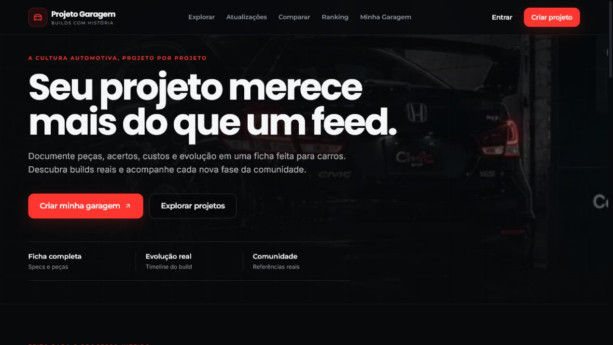
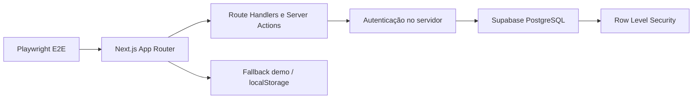

<p align="center">
  
</p>

<p align="center">
  <a href="https://github.com/Gustavo-tec0110/ProjetoGaragem/actions/workflows/ci.yml"></a>
  
  
  
  
</p>

# Projeto Garagem

Plataforma full stack para publicar, explorar e acompanhar projetos automotivos. O MVP combina uma experiência pública navegável com autenticação, garagem pessoal, interações sociais e persistência no Supabase. Sem credenciais de banco, o projeto mantém um modo de demonstração explícito para desenvolvimento e avaliação.

## Screenshots

<p align="center">
  
</p>

## Demonstração

- **Aplicação:** [projetogaragem.netlify.app](https://projetogaragem.netlify.app)

O modo de demonstração também pode ser executado localmente sem credenciais do Supabase seguindo as instruções abaixo.

## Funcionalidades

- exploração de projetos com busca, filtros, ordenação e sugestões;
- cadastro, autenticação e perfil de usuário;
- criação e edição de projetos automotivos com imagens;
- garagem pessoal e itens salvos;
- curtidas, comentários e acompanhamento de pessoas e projetos;
- notificações de interações;
- fallback local/demonstração quando o Supabase não está configurado;
- fluxos E2E públicos e autenticados em desktop e viewport mobile.

## Arquitetura



As regras de mutação passam por autenticação no servidor, enquanto as políticas RLS formam a barreira final no banco. Os adaptadores em `src/lib/projects` isolam consulta, normalização e fallback, evitando que a interface dependa diretamente da fonte dos dados.

## Tecnologias

| Camada | Tecnologias |
|---|---|
| Aplicação | Next.js 16, React 19, TypeScript |
| Interface | Tailwind CSS 4, Radix UI, Lucide |
| Dados e autenticação | Supabase SSR, PostgreSQL, RLS |
| Testes | Playwright |
| Qualidade | ESLint, TypeScript, GitHub Actions |

## Como executar

Requisitos: Node.js 20+ e npm.

```bash
git clone https://github.com/Gustavo-tec0110/ProjetoGaragem.git
cd ProjetoGaragem
npm ci
npm run dev
```

Acesse `http://localhost:3000`. Para validar uma build de produção:

```bash
npm run build
npm start
```

## Configuração

Copie `.env.example` para `.env.local`:

```env
NEXT_PUBLIC_SUPABASE_URL=https://SEU-PROJETO.supabase.co
NEXT_PUBLIC_SUPABASE_ANON_KEY=SUA_CHAVE_ANON_PUBLICA
NEXT_PUBLIC_SITE_URL=http://127.0.0.1:3000
```

Somente a chave `anon` pode ser usada no frontend. A chave `service_role` nunca deve ser exposta ao navegador. Valores vazios mantêm apenas os fallbacks demo/local.

## Qualidade e testes

```bash
npm run lint
npm run typecheck
npm run build
npm run test:e2e
```

Os testes públicos cobrem navegação, busca e estados essenciais. Os fluxos autenticados exigem duas contas exclusivas de QA:

```env
E2E_USER_EMAIL=usuario-qa@example.com
E2E_USER_PASSWORD=senha-de-qa
E2E_SECOND_USER_EMAIL=segundo-qa@example.com
E2E_SECOND_USER_PASSWORD=senha-de-qa
```

Sem essas quatro variáveis, a suíte autenticada é ignorada de forma explícita e os testes públicos continuam sendo executados.

## Estrutura do projeto

```text
src/
├── app/                 # páginas, route handlers e Server Actions
├── components/          # UI, autenticação, garagem e projetos
└── lib/
    ├── garage/          # regras de criação e edição
    ├── projects/        # busca, filtros, mapeadores e fallback
    └── supabase/        # clientes, consultas e autenticação server-side
supabase/migrations/     # schema e políticas RLS versionadas
tests/e2e/               # fluxos Playwright
```

## Aprendizados

- separação entre interface, regras de domínio e acesso a dados;
- autorização em profundidade com validação no servidor e políticas RLS;
- construção de fluxos E2E reproduzíveis para áreas públicas e autenticadas.

## Segurança

- autenticação revalidada no servidor antes de mutações;
- RLS aplicada às tabelas do Supabase;
- credenciais reais excluídas do repositório;
- contas de QA separadas de usuários reais;
- migrations históricas preservadas para rastreabilidade.

Consulte [SECURITY.md](SECURITY.md) antes de relatar uma vulnerabilidade.

## Próximas melhorias

- [ ] adicionar testes unitários para regras puras de busca e filtros;
- [x] publicar uma instância de demonstração estável;
- [ ] documentar observabilidade e estratégia de backup do Supabase;
- [ ] ampliar validações de acessibilidade automatizadas.

## Contribuição

Veja [CONTRIBUTING.md](CONTRIBUTING.md) para o fluxo de desenvolvimento e os critérios de aceite.

## Licença

Distribuído sob a licença MIT. Consulte [LICENSE](LICENSE).

## Autor

Desenvolvido por **Gustavo Lopes** — [GitHub](https://github.com/Gustavo-tec0110).
